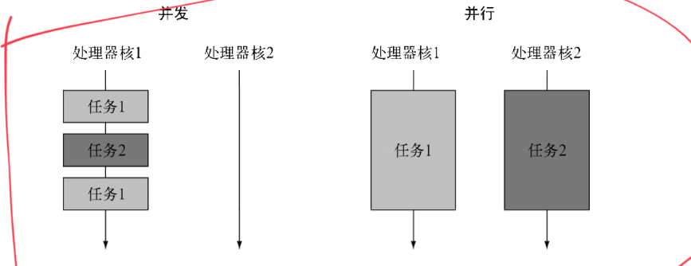

# Future接口与它的实现CompletableFuture

## 并发与并行



- 并行请求
- 并发处理

## Future接口

Future 接口来自 JDK 5，设计初衷是对将来某个时刻发生的结果进行建模。

基本使用方式：将一个耗时操作放于Callable对象中，将它提交给 ExecutorService。

```java
public class FutureUsageTest {
    public static void main(String[] args) {
        ExecutorService executor = Executors.newCachedThreadPool();
        Future<Double> future = executor.submit(() -> doSomeLongComputation());
        doSomeThingElse();
        try {
            Double result = future.get(1, TimeUnit.SECONDS);
        } catch (InterruptedException e) {
            e.printStackTrace();
        } catch (ExecutionException e) {
            e.printStackTrace();
        } catch (TimeoutException e) {
            e.printStackTrace();
        }
    }

    private static void doSomeThingElse() {
        System.out.println("doSomeThingElse()");
    }

    private static Double doSomeLongComputation() {
        return 1.0;
    }
}
```

## 调整线程池大小

N(threads)=N(CPU)\*U(CPU)\*(1+W/C)

- N(CPU)= Runtime.getRuntime().availableProcessors()
- U(CPU)是希望的CPU利用率
- W/C是等待时间与计算时间的比率

假设你的应用99%的时间都在等待商店的响应，那么计算时间为1%。W/C=99。

假设期望的CPU利用率100%，N（CPU）=4，那么: N(threads) = 4 \* 100% \* (1+99)=100

## Stream VS CompletableFuture

- 计算密集型：推荐Stream
- 涉及I/O，网络等待：推荐CompletableFuture

Stream底层依赖的是线程数量固定的通用线程池。自定义CompletableFuture调度任务可以更加灵活利用CPU资源。

## CompletableFuture

- .thenCompose 第一个操作的结果传递给第二个操作
- .thenCombine 合并两个不相关操作的结果